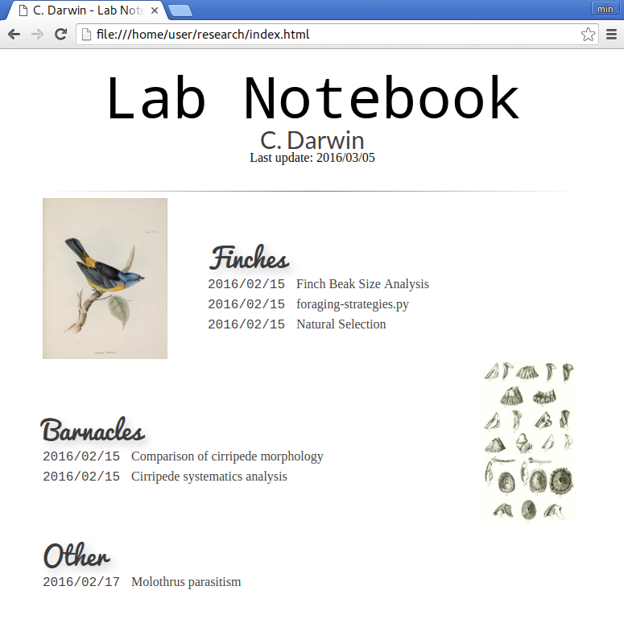

Labnote
=======

[](https://travis-ci.org/khughitt/labnote)

Overview
--------

Labnote is a flexible and lightweight tool for generating simple HTML-based
[electronic lab notebook](https://en.wikipedia.org/wiki/Electronic_lab_notebook).

Instead of attempting to provide a unified framework for recording lab notebook
entries, it instead attempts to simply tie together existing documents and
analyses, possibly stored in different formats, and build an HTML index of the
resources.

In short, it helps you go from something like this:

    ├── animal_behavior
    │   └── molothrus
    │       └── README.html
    ├── barnacles
    │   ├── cirripede-morphology
    │   │   └── README.html
    │   └── cirripede-taxonomy
    │       └── README.html
    └── finches
        ├── finch-beak-size-comparison
        │   └── beak_size.py
        ├── finch-foraging-strategies
        │   └── foraging-strategies.py
        └── natural-selection
            └── thoughts.txt

To something like this:



Labnote works by scanning a set of one or more directories for files matching a
pattern that you specify as pertaining to notebook entries (e.g. a single
log, script, or document describing some particular project or analysis.) It
then constructs an HTML table of contents pointing to each of the matching
files. By default, results are sorted by date last modified and additional 
search expressions can be used to define categories to break up the analyses.

In order to support as many different work styles as possible, labnote tries
and make as few assumptions as possible about how your files are organized and
the configuration options should allow for a wide range of directory structures
and file types.

Finally, labnote is designed to be extensible. While currently there is only 
a single no-frills theme, the [jinga2](http://jinja.pocoo.org/docs/dev/)
templating system used by Labnote makes it trivial to create themes.

Installation
------------

### Requirements

To use labnote, you must have a recent version of Python ([Python 3 (3.3+)](https://www.python.org/))
available on your machine.

Additionally, labnote requires the following Python libraries:

- [Beautiful Soup 4](http://www.crummy.com/software/BeautifulSoup/)
- [Jinja2](http://jinja.pocoo.org/docs/dev/)
- [PyYAML](http://pyyaml.org/)

If you are using pip to install labnote, all of the required dependencies should
be automatically installed for you.

Labnote is currently aimed at supporting Linux and OS X setups.

### Installing labnote

To install labnote using [pip](https://docs.python.org/3.5/installing/index.html), run:

```
pip install https://github.com/khughitt/labnote/archive/master.zip
```

Once the development is a little further along, labnote will be uploaded to
[PyPI](https://pypi.python.org/pypi) and can then be installed using the usual
`pip` or `easy_install` commands.

### Testing installation

To generate the example notebook, cd to the labnote source directory and run:

```
labnote -c example/example.config.yml -i example/research/*/* -o example/
```

A file named `index.html` should be outputted to the `example/` directory and
should look something like what is shown in the screenshot above.

### Automating notebook generation

@TODO

Configuration
-------------

### Notebook configuration

Labnote settings are controlled can be specified either via the command-line at
run-time (e.g. `labnote -i /some/path/* -o /output/dir`), or using a
[YAML](http://yaml.org/) config file, or both.

By default, Labnote looks for a file named `config.yml` located in
`$HOME/.config/labnote/`. If this file exists, then it will be used used to
configure Labnote's behavior.

The configuration file should look something like:

```
---
# General information
title: Lab Notebook
author: Your Name
email: email@address.com

# Notebook contents
input_dirs:
  - /home/user/Dropbox/research/201[2-5]/*
  - /home/user/Dropbox/research/2016/*/*
  
output_dir: /home/user/Dropbox/research/

include_files: ['*.html', '*.py', '*.ipynb', 'README.*']

# Research categories
categories:
  'Sequence Analysis': ['seq', 'dna', 'rna']
  'Differential Expression': ['dea', 'differential-expression']
  'Network Analysis': ['network']
  'Visualization': ['viz']
```

The main settings that are important to define are:

1. `input_dirs` - One or more [wildcard](http://tldp.org/LDP/GNU-Linux-Tools-Summary/html/x11655.htm) filepath expressions
2. `output_dir` - Path to save resulting HTML and its associated files to. Most
   often, this will be some parent directory of the input directories, possibly
   in a web-accessible location (e.g. `/var/www/` or `~/public_html`).
3. `include_files` - Files to link to in your notebook.
4. `categories` - A set of categories you would like to use to organise your
   notebook, along with some search strings which can be used to find project
   directories that should be placed under those categories.*

You can also point to a config file located in a
different location using the `-c` option, e.g. `labnote -c
/path/to/config.yml`. If a setting is specified both in a configuration file
and using a command-line switch, the option specified on the command-line will
take precedence.

*Depending on how you have organized your files, this may be difficult to
setup. It works best if you can normalize your directory names such that
related analyses all include a similar component (e.g. 'xx-network-analysis').

If that is not possible or convenient, Labnote will also soon support manually
specifying a projects categorization using hidden metafiles inside each project
directory.

### Customizing individual entries

@TODO

Development
-----------

### Contributing

The project is just getting started and is changing rapidly.
[mailto:khughitt@umd.edu](Let me know) if you have suggestions or would like to
contribute.

### Running tests

The easiest way to run the unit tests for labnote is to create a virtualenv
container and run the tests from within there. For example, if you have
[virtualenvwrapper](https://virtualenvwrapper.readthedocs.org/en/latest/), you 
can run:

```
git clone https://github.com/khughitt/labnote && cd labnote
mkvirtualenv labnote
pip install -e .
pip install pytest
hash -r
py.test
```

If you already cloned the labnote repo, you can skip the first step above and
simply `cd` to the repo directory.

The `hash -r` command in the above is needed after installing py.test to ensure
that the virtualenv version of py.test is used, and not a system version.

To run the tests for a different version of Python, you can simply create a
second virtualenv for that version of Python and repeat the process:

```
mkvirtualenv --python=python3.3 labnote33
```

Note that virtualenvwrapper is not needed to run the tests, and the commands
for using the base version of virtualenv are pretty similar.

### TODO

Things to be added...

- Add option to print default config.yml
- Check for git revision and link to repo if on Github
- Add support for customizing display of entries using .entry.yml files for a
  given directory:
    - For each entry, let user specify filename, title, description, etc.
    - Allow specifying one or more entries to include for the directory
    - Allow for optional thumbnail to be specified.
    - Allow links to external files and URLs to be included (e.g.
      presentations, papers, etc.)
- Copy files from resources directory even if they already exists; this way any
  new files or updates will be included.

